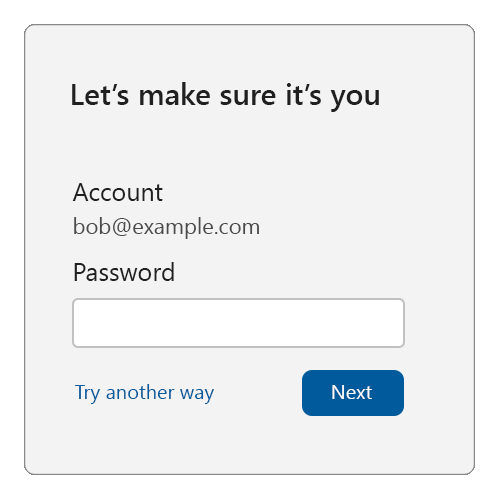
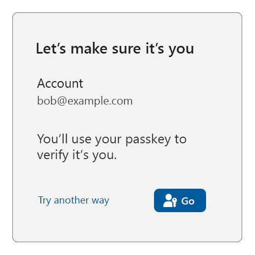
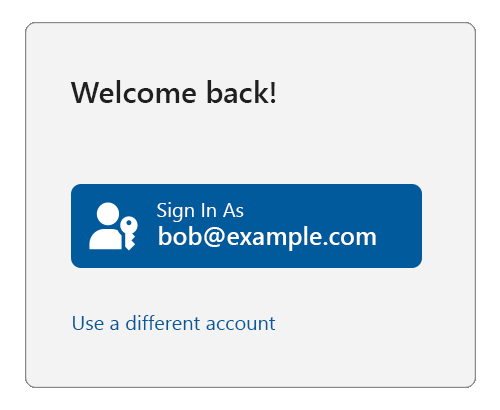
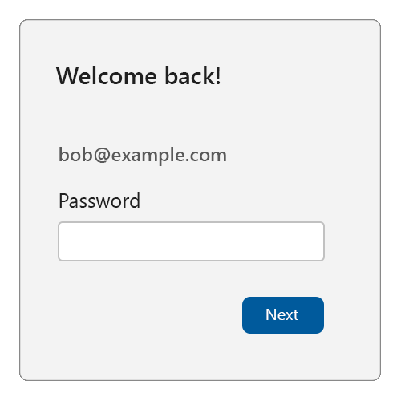
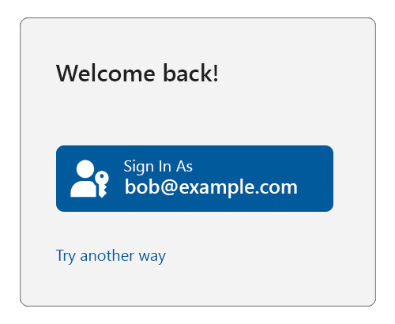

Reauthentication might happen for the following reasons:

- The user signed out and now wants to sign in again
- The user session expired due to inactivity, and the user wants to sign in again
- The user is about to perform a sensitive action, and needs to re-confirm control over the user session

You’ll use passkeys that you set up in the [previous section](../bootstrapping) to reauthenticate the user in each of these situations. The WebAuthn API call is the same in all three cases, but the UI treatment that you provide is slightly different. Since the particular account is specified by you, the platform will not offer the user to select a different account on your service.

## Sensitive Actions

Let’s look at the UI for the last case first: when it’s time to re-authenticate for a sensitive action, check whether you have a credential ID for at least one passkey for the user.

If _no such credential ID is available_, serve a traditional login challenge suitable for reauthentication, for example:



> We recommend that on this login challenge page, users can’t change their account identifier. Also, the login challenge should be something that an unauthorized user of the device can’t pass.

If, however, you do find at least one passkey credential ID for the user, then you can use passkeys for reauthentication:



When the user is ready (in the above example, when they click on the "Go" button), call `navigator.credentials.get()`, passing in all the user’s passkey credential IDs:

```js
navigator.credentials.get({
  publicKey: {
    challenge: ...,
    rpId: ...,
     allowCredentials: [{
      type: "public-key",      
      id: new UInt8Array([21, 31, 56, ...]).buffer,
    }, {
      type: "public-key",
      id: new UInt8Array([21, 31, 56, ...]).buffer,
    }, {
      ...
    }],
    // see note below
    userVerification: "preferred", 
  }
});
```

> NOTE: Be sure to read the guidance around userVerification from the [previous page](../bootstrapping#a-note-about-user-verification)

If the user instead clicks on "Try another way", you should offer them other sign in methods (password, etc.) to reauthenticate them (assuming the user has such other sign in methods available to them).

## Expired Sessions and Logout

Now let’s look at the case where the reauthentication is triggered because the user logged themselves out, or the relying party expired the user's session. To facilitate this, the relying party would have to keep some form of user session state reminding them of the account that used to be signed in, even when they consider the user signed-out (this could be achieved using browser artifacts such as cookies or local storage).

> Note that a relying party may choose to treat signing-out as a comprehensive action and thus delete all references to the user’s identity. Such a relying party ought to treat a subsequent sign-in like an account bootstrap, and repeat the steps explained above.

You, as the relying party, might then serve a sign-in page like this:



If the user clicks on "Use a different account", then you should enter an account bootstrap flow as explained on the previous page, repeating the steps in [Bootstrapping an account](../bootstrapping), where the platform will let them select which account they want to use.

> In this case, you should also give the user the ability to completely remove the suggested account from being listed on the sign-in page.

But if the user clicks the "Sign in as" button, check whether you have at least one passkey credential ID associated with the user. If no credential ID is available, serve a traditional login challenge suitable for reauthentication, for example:



If, however, you _do_ find at least one passkey credential ID for the user, then you can use passkeys for reauthentication:



When the user is ready (in the above example, when they click on the “Go!” button), call `navigator.credentials.get()`, exactly as shown above (i.e., by passing in all the user’s passkey credential IDs).

If the user instead clicks on "Try another way", you should offer them other sign in methods (password, etc.) to reauthenticate them.
